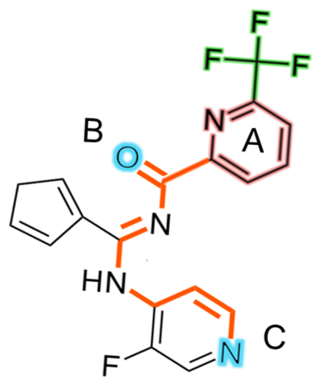

# PGMG

----
<a rel="license" href="http://creativecommons.org/licenses/by-nc-sa/4.0/"></a>

https://www.nature.com/articles/s41467-023-41454-9

This repository contains the PyTorch implementation of *A pharmacophore-guided deep learning approach for bioactive molecular generation*. 

Through the guidance of pharmacophore, PGMG provides a flexible strategy to generate bioactive molecules with structural diversity in various scenarios using a trained variational autoencoder.

**Update on 02/05/2023: [The PGMG web server](https://www.csuligroup.com/PGMG) is now available! Experience PGMG without having to perform any deployments on your own.** 


## Overview

PGMG aims to provide a flexible strategy to generate bioactive molecules with structural diversity in various scenarios, especially when the activity data is scarce.

PGMG only requires a pharmacophore hypothesis as input. The hypothesis can be constructed using only a few ligands or the structure of the receptor or the ligand-receptor complex.
The pharmacophore hypothesis will be transformed into a weighted complete graph based on the shortest-path distance and feed into the model. The model will then rapidly generate a large number of molecules that satisfy the conditions.


## Requirements
- python==3.8
- torch==1.12.1+cu102
- rdkit==2022.09.1
- dgl-cuda10.2==0.9.1
- fairseq==0.10.2
- numpy==1.23.5
- pandas==1.5.2
- tqdm==4.64.1
- einops==0.6.0

> If you encounter `RuntimeError: mat1 and mat2 shapes cannot be multiplied`, please check the version of `fairseq` first. It should be `10.2`.

### Creating a new environment in conda
We recommend using `conda` to manage the environment. 

```bash
conda env create -f environment.yml
```

## Training

The training process with default parameters requires a GPU card with at least 10GB of memory.

Run `train_chembl_baseline.py` using the following command:
```bash
CUDA_VISIBLE_DEVICES=<gpu_num> python train_chembl_baseline.py <output_dir> --show_progressbar
```
- the `gpu_num` indicates which gpu you want to run the code
- the `output_dir` is the directory you want to store the trained model

Other configurations need to be changed inside `train_chembl_baseline.py`, including model settings and the data directory.

It takes about 70 hours to run the training script with default parameters using a single 2080Ti.

## Using a trained PGMG model to generate molecules


### Prepare the pharmacophore hypotheses

First of all, you need some pharmacophore hypotheses. A pharmacophore is defined as a set of chemical features and their spatial information that is necessary for a drug to bind to a target and there are many ways to acquire one. 

If you have a biochemistry background, we strongly encourage you to build it yourself by stacking active ligands or analyzing the receptor structure. There are also many tools available. 
And you can always adjust the input hypothesis according to the results.

Apart from building it yourself, you can also acquire them by searching the literature or just randomly sampling 3-6 pharmacophore elements from a reference ligand to build some hypotheses and filtering the generated molecules afterwards.


### Format the hypotheses

The pharmacophore hypotheses need to be converted to a fully-connected graph and should be provided in one of the two formats:

- the `.posp` format where the type of the pharmacophore points and the 3d positions are provided, see `data/phar_demo2.posp` for example. 
- the `.edgep` format where the type of the pharmacophore points and the shortest-path-based distances between each point are provided, see `data/phar_demo1.edgep` for example. 

**Pharmacophore types** supported by default:
- AROM: aromatic ring
- POSC: cation
- HACC: hydrogen bond acceptor
- HDON: hydrogen bond donor
- HYBL: hydrophobic group (ring)
- LHYBL: hydrophobic group (non-ring)

The 3d position in `.posp` files will first be used to calculate the Euclidean distances between each point and then the distances will be mapped to the shortest-path-based distances.

See the Supplemental Information of our paper for detailed descriptions.

**How to calculate shortest-path distances**: 
The shortest path between pharmacophore point `a` and `b` is calculated as $D_{a,b} = D_{inter_{a,b}}+D_{intra_{a}}+D_{intra_{b}}$.

$D_{inter}$ is the sum of the lengths of each bond on the shortest path between two pharmacophore points, where the length of a single covalent single bond is set to 1, a double bond 0.87, an aromatic bond 0.91, a triple bond 0.78. 

$D_{intra}$ is the distance between the center of the pharmacophore point and the edge of it. If the pharmacophore is a ring, then the distance is calculated as `0.2*N`, where N is number of heavy atoms in the pharmacophore point.

For example, the shortest-path distances between A-B and A-C in the picture below can be calculated as:

$$ D_{A,B}=D_{inter_{A,B}}+D_{intra_A}=(1+0.87)+(0.2*6)=3.07 $$

$$ D_{A,C}=D_{inter_{A,C}}+D_{intra_A}=(1+1+0.87+1+1+0.91+0.91+0.91)+(0.2*6)=8.8 $$

<div style="text-align:center">  </div>


### Generate

Use the `generate.py` to generate molecules.

usage:
```text
python generate.py [-h] [--n_mol N_MOL] [--device DEVICE] [--filter] [--batch_size BATCH_SIZE] [--seed SEED] input_path output_dir model_path tokenizer_path

positional arguments:
  input_path            the input file path. If it is a directory, then every file ends with `.edgep` or `.posp` will be processed
  output_dir            the output directory
  model_path            the weights file (xxx.pth)
  tokenizer_path        the saved tokenizer (tokenizer.pkl)

optional arguments:
  -h, --help            show this help message and exit
  --n_mol N_MOL         number of generated molecules for each pharmacophore file
  --device DEVICE       `cpu` or `cuda`, default:'cpu'
  --filter              whether to save only the unique valid molecules
  --batch_size BATCH_SIZE
  --seed SEED
```

The output is a `.txt` file containing the generated SMILES. It takes about 30 seconds to generate 10,000 molecules using a single 2080Ti, and about 10 minutes if using CPUs.

To run generation on the demo input:
```bash
python generate.py data/phar_demo1.edgep demo_result/ weights/chembl_fold0_epoch32.pth weights/tokenizer.pkl --filter --device cpu
```

**We provide the weights file acquired using `train_chembl_baseline.py` in the [release page](https://github.com/CSUBioGroup/PGMG/releases/tag/v1.0).** Please unzip it in the root directory.

**The current model only support a maximum of 8 pharmacophore points in a single hypotheis.** If you want to increase the maximum number, a possible way is to re-train the model with increased number of randomly selected pharmacophore elements and a larger `MAX_NUM_PP_GRAPHS`.


## Evaluations

Use `get_match_score(smiles,dgl_graph)` in `utils.match_eval` to calculate the match score between molecules and pharmacophores. 

For example:

```python
from pathlib import Path

from utils.file_utils import load_phar_file
from utils.match_eval import get_match_score

smiles_list = ['Cc1ccc(C(=O)Nc2c(C(N)=O)sc3ncccc23)o1', 'O=C(NC1CCCCC1)c1cc2c(nc(O)c3ccccc32)s1']

file_path = Path('data/phar_demo1.edgep')

dgl_graph = load_phar_file(file_path)

dgl_graphs = [dgl_graph, dgl_graph]

match_scores = get_match_score(dgl_graphs, smiles_list,  n_workers=8, timeout=20)  # [0.67, 1.0]
```


----

## License

This work is licensed under a <a rel="license" href="http://creativecommons.org/licenses/by-nc-sa/4.0/">Creative Commons Attribution-NonCommercial-ShareAlike 4.0 International License</a>.

For commercial use, please contact [limin@csu.edu.cn](mailto:limin@csu.edu.cn).
